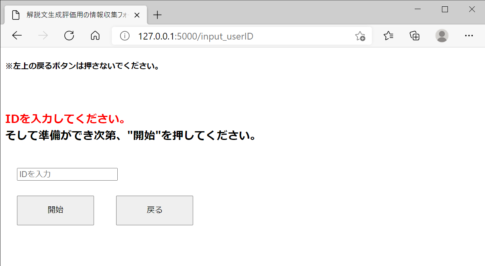
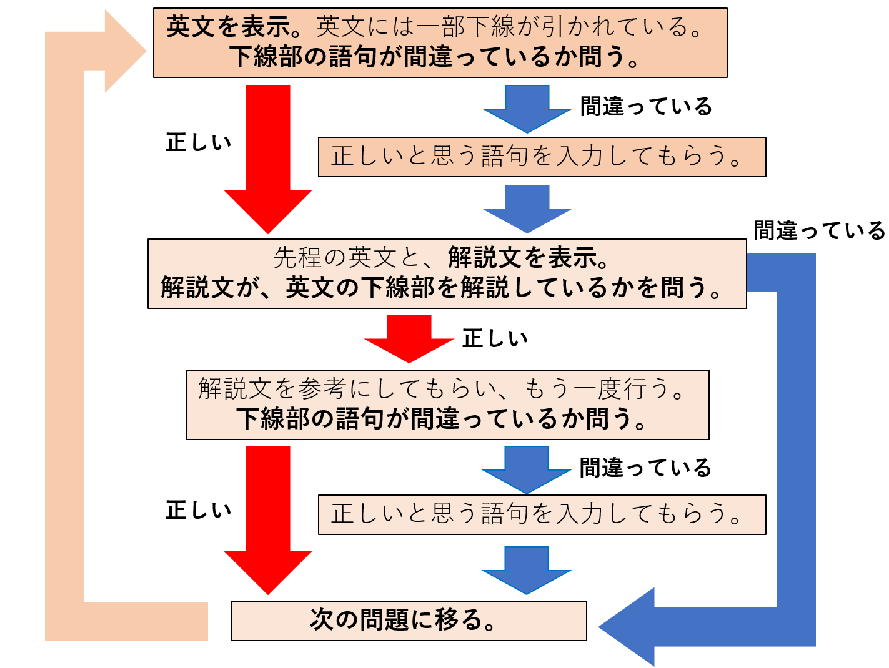

# 情報収集システム
　このシステムは、解説文生成システムの学習効果についてを評価をするために、必要な情報を収集する事を目的として、開発されたシステムである。<br>
　必要な情報とは、
1.`解説表示前に解答した情報`
2.`解説表示後に解答した情報`
である。解答とは、文法間違いを含む英文を、正しく修正した解答である。<br>
　またこのシステムは、複数人の被験者を集めて行う事を想定している。


### 概要
　このシステムの大まかな流れとしては、まずユーザに英文と間違い箇所の情報を表示し、正しいと思うものを解答してもらう。続いて、先程の情報に解説文の情報をプラスし、もう一度解答してもらう。更に詳しいことは後の、Phaseについて説明しているところを見てもらいたい。<br>
　また、ユーザIDによって、誰の解答情報かを区別できるようにしている。ユーザIDは、0,1,2,... と順番に割り振られる。

### 入出力ファイル
　[./input](https://github.com/yusuke1565/gathering-info-system/tree/master/input)に、このシステムの入力データが存在する。詳しいことは、[input/readme.md](https://github.com/yusuke1565/gathering-info-system/tree/master/input/readme.md)で記す。<br>
　[./output](https://github.com/yusuke1565/gathering-info-system/tree/master/output)に、出力データがある。こちらも[output/readme.md](https://github.com/yusuke1565/gathering-info-system/tree/master/output/readme.md)を参照してもらいたい。<br>
　[./ex_input](https://github.com/yusuke1565/gathering-info-system/tree/master/ex_input)と[./ex_output](https://github.com/yusuke1565/gathering-info-system/tree/master/ex_output)は、例題の入力と出力情報が記されている。例題の出力情報には、しっかり入力出来ているかを確かめる為だけなので、テキストボックスに入力された情報のみ記録される。

### 実行要件
python 3.8.5以上<br>
Flask 2.0.0以上<br>
pyenchant 3.1.1以上<br><br>
```python
pip install -r request/requirement.txt
```
でpython以外は、まとめてインストールできる。

### 実行
```python:/evaluation-system
$ python3 app.py
```
と打ち込み、`Running on http://127.0.0.1:5000/`と表示されれば実行完了である。そして、[http://127.0.0.1:5000/](http://127.0.0.1:5000)にアクセスすると、ホームに飛ぶ。もしポート（:5000）が既に使用中の場合は、app.pyの一番下の`app.run`の、`port="5000"`の値を適当に変えてほしい。<br>
　今の設定では、外部からこのシステムにアクセスできない。もし、実行中のハード以外からのアクセスを許可する場合は、app.pyの`app.run`を、
```python:app.py
app.run(host="0.0.0.0", port="<適当な値>")
```
と書き換えると、外部からもアクセスできるようになる。またこの場合のURLは、`http://<実行中のPCの、wifiのIPv4アドレス>:<設定したポート番号>`となる。アクセスできる端末は、同じwifiにつながっている必要がある。

### ホーム
　ここからは、各ページの説明を行う。<br>
　ホームでは、"初めて","2回目以降","例題"、という3つのボタンがある。初めて情報収集に協力してもらう場合は、"初めて"。それ以外は、"2回目以降"。例題を実行する場合は、"例題へ"を押す。


### 初めて
　ホームで"初めて"を押すと、準備画面に飛ぶ。ここでは、特に動きはなく、"開始"ボタンを押して開始するか、ホームに"戻る"ボタンがある。開始前の準備ページである。"開始"ボタンを押すと、ユーザIDが割り振られる。


### 2回目以降
　ホームで"2回目以降"を押すと、ID入力画面に飛ぶ。ここでは、ユーザIDを入力して開始するページである。もし存在しないIDを入力すると、エラーが返される。



### 例題
　ホームで"例題へ"を押すと、5問の例題が出題される。動きは本番と同じ動きであり、画面の見方や操作に慣れてもらうために行う。<br>
　URLは`/ex/＜Phase＞`となる。＜Phase＞とは、このシステムの状態を6段階（one～five +end)で表したものである（例：/ex/two）。＜Phase＞の詳しい事については、後ほど記す。`/ex/...`は例題を出題している時を表す。


<br>
　例題5問が終了すると、ホームに戻る用のボタンがある。


## スタート
 準備画面または、ID入力画面で"開始"ボタンを押すと、情報集収の本番が始まる。URLは、`/<userID>/<Phase>/<Number of problems>`のような形になる。＜userID＞は、0や19といったユーザIDである。＜Number of problems＞は、何問目かを表す数字である。ここでは、実際に問題を出題し、情報を収集するところである。
<hr>

## Phase
　ここからは,Phaseについて説明していく
#### one
　phase1は、英文に間違いがあるかを問う段階である。ユーザに下線が引かれた英文を表示する。その状態で、ユーザに下線部の語句に誤りがあるかを問う。下線部の語句が、誤りを含むと答えた場合はPhase2へ。正しいまたは分からないと答えた場合はPhase3へ。

#### two　
 Phase2は、正しいと思う語句を入力してもらう段階である。Phase1で間違いを含んでいると答えた人は、ここで正しいと思う語句を入力してもらう。下線部を削除したり、分からないという選択肢もある。ここでスペルチェックが入り、もし存在しない単語を入力したりすると、もう一度入力画面に戻される。入力が終わると、Phase3に移行する。

#### three
　Phase3は、解説文の内容が正しいかを問う段階である。ここからは解説文も表示されるので、まずは解説の内容が正しいかを確認する。正しいと答えた場合はPhase4へ。間違っていると答えた場合は次の問題へ移行し、Phase1に戻る。

#### four
　Phase4は、英文に間違いがあるかを問う段階である。Phase1と違うのは、解説文の有無である。誤りを含むと答えた場合はPhase5へ。正しいまたは分からないと答えた場合は次の問題へ移行し、Phase1に戻る。

#### five
　Phase5は、正しいと思う語句を入力してもらう段階である。Phase2と違うのは、解説文の有無である。入力が終わると次の問題へ移行し、Phase1に戻る。


<hr>

## リセット
　今までの解答データやユーザのID情報など、すべてリセットしたい場合は、
```python:reset
$ python3 reset.py
```
と入力する。
